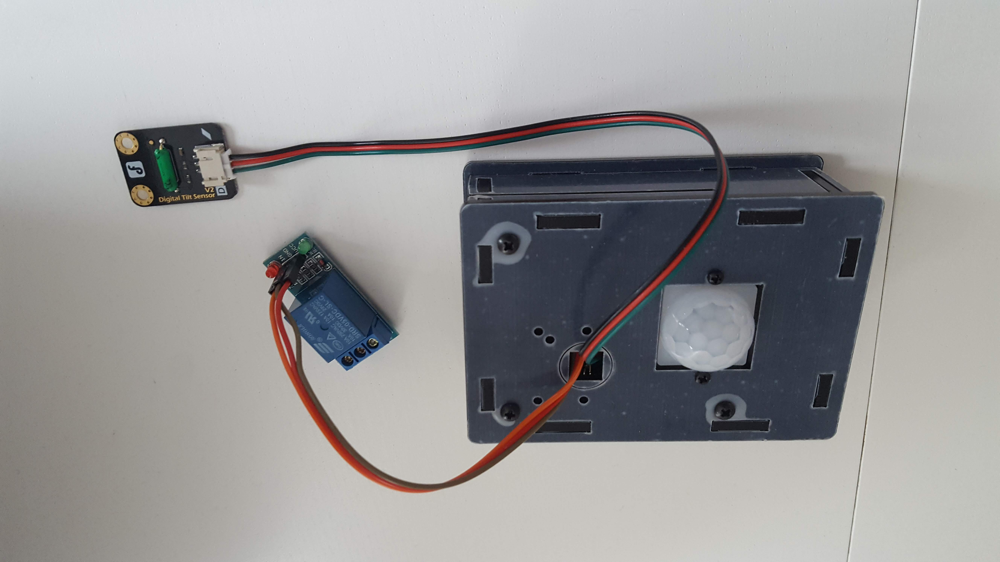

# Motion detection examples

A motion detection using Pi camera sensor and a motion detection using a tilt sensor is briefly described here.

## Hardware

The required hardware consists:
* Raspberry Pi 3 Model B+
* [ModMyPi - Pi PIR Motion Sensor Camera Box - B+/2/3](https://www.pi-shop.ch/modmypi-pi-pir-motion-sensor-camera-box-b-2-3)
* (Optional) [Pi Camera sensor box](https://www.pi-shop.ch/modmypi-pi-pir-motion-sensor-camera-box-b-2-3)
* Tilt sensor ([Gravity: Digital Tilt Sensor for Arduino / Raspberry Pi (DFR0028)](https://www.dfrobot.com/wiki/index.php/Digital_Tilt_Sensor_SKU:DFR0028))
* [5V 1-Channel Relay Module Board for Arduino](http://www.circuitbasics.com/setting-up-a-5v-relay-on-the-arduino/): Relay for switch on / off


## Motion detection using Pi Camera

Goal: detect motion using a camera sensor and switch on/off a 5V relay.

Use case: Low budget alarm system.


### Screenshots



### Output logs

```
./motion.py
pi@raspberrypi:~ $ tail -F monitor.log
INFO:root:Motion Detected at 2018-12-26 21:12:23!!
INFO:root:Quit?
INFO:root:Started
INFO:root:PIR Module Test (CTRL+C to exit)?
INFO:root:Ready?
INFO:root:Sleeping for 100ms
INFO:root:Motion Detected at 2019-02-03 11:20:56!!
INFO:root:Motion Detected at 2019-02-03 11:21:01!!
INFO:root:Motion Detected at 2019-02-03 11:21:05!!

```
## Motion detection using tilt sensor (perturbation)

Goal: detect motion using a tilt sensor and switch on/off a 5V relay.

Use case: Low budget alarm system.
